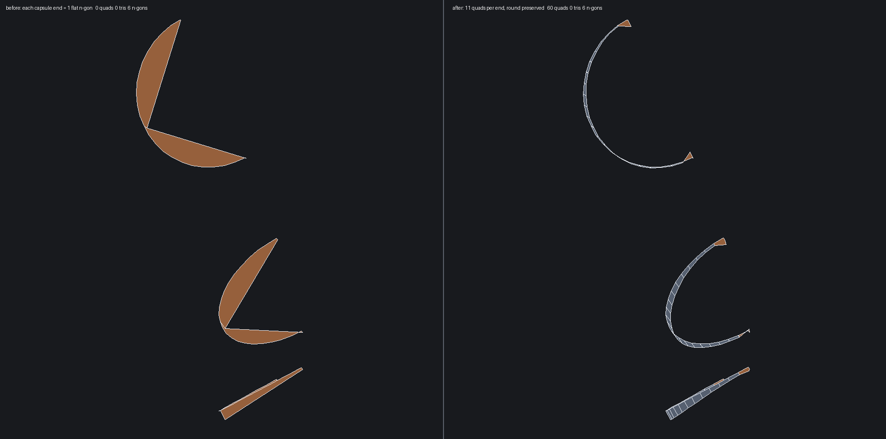

# Capsule slots lose their round to a trim-grid pin (2026-07-25)

Artist report: the MP9 muzzle's capsule slots "are supposed to be capsules, but
the hole doesn't have that at all" — the ends read as flat faces.

## Root cause (measured, not inferred)

The counts are already correct. Probing the four sides of a capsule end wall
(muzzle extract face 6, a quarter-cylinder) gives:

```
sideprobe face 6: nu=11 nv=1 sides e38=11 e35=1 e37=11 e36=1 natB=2 ...
```

11 on both arcs, 1 on both straight rulings — exactly right for a round wall
one division deep. Nothing is mismatched.

What flattens it is a PIN. The drum plans as an orthogonal trim grid, and
`pinOrthogonalTrimGrids` pins every shared boundary edge to its endpoints plus
its crossings with the grid's station lines. A capsule end arc crosses no
station line, so it is pinned to exactly two fractions, 0 and 1. A pin is the
authoritative sampling for an edge wherever it is read, so:

- the drum draws that arc as one straight chord (chamfered slot end), and
- the end wall's side collapses to 2 points, leaving no lattice, so it ships as
  a single crescent n-gon.

Both symptoms, one cause.

## The change

Seed the pin with the edge's OWN solved samples (curved edges only — interior
samples on a line carry no shape) in addition to the station crossings. The
curve's count is what makes it round; the stations only add the crossings the
clip needs.

Result on the muzzle extract:

| | before | after |
| --- | --- | --- |
| capsule end wall (face 6) | 1 n-gon | 10 quads + 1 pentagon |
| drum slot cells (face 21) | 9 n-gons | 21 pentagons + 3 hexagons |
| MP9 coons/plane extract cracks | 52 | 26 |



## Progress on the fallout (2026-07-25, second pass)

Ordering inside the pin is what matters. The first version appended the edge's
own samples and then deduped at 1e-10, which left a station crossing sitting a
micron from a natural sample as its own pin — a near-zero border segment that
tears the weld on whichever neighbour reads the same edge. Deduping at a
fraction of the sample spacing instead was worse: it dropped crossings, and a
crossing is the whole reason the pin exists (MP9 then gained folds and
non-manifold edges).

The order that works: crossings are mandatory and go in first, then the edge's
own samples are added only where they do not crowd one (0.35 of a sample
spacing). That took the suite from 10 failures to 5:

| | first pass | now |
| --- | --- | --- |
| foam (cad) | 3 open, 2 winding | clean |
| flaregun, iso14649-demo | clean | clean |
| MP9 coons/plane extract cracks | 26 | 24 (baseline 52) |
| teleporter (cad) | 2 winding | 28 open, 2 winding |
| capsule end wall | 11 polys | 11 polys |

Two dead ends, both reverted: deriving cell orientation from the UV signed area
instead of a 3D Newell normal (teleporter got worse, so the Newell cancellation
theory was wrong), and skipping the station snap for pinned samples (no
measurable effect).

## Why this is NOT merged

`teleporter` still regresses, so this stays parked:

- `teleporter` (cad): 28 open edges, 2 winding conflicts
- `testMp9CoonsPlaneSeamCanonicalize`: `floors <= 1` exceeded

The cracks are between trim-grid drums (faces 91, 302, 306, 384 — all
`cylinder / drum/iso-band`, the same class as the muzzle) and their neighbours,
which are `minimal-ngon` planes (96, 98, 443, 444) and bspline Coons faces
(326, 329). So the drum reproduces the denser pin and at least one of those
neighbour paths does not sample the shared edge at the pin's fractions. That is
the next thing to check: whether `samplePlanarRings` and the Coons side sampler
both consume pin fractions or only the pin's COUNT.

Narrowing the seeding to curved edges, and then to RevolutionGrid plans only,
does not help — teleporter's cracking faces are exactly that class.

## Reproducer

```sh
weft extract tests/STEP_Examples/MP9.stp --faces 3432 --rings 1 -o muzzle.step
weft mesh muzzle.step -o muzzle.obj --profile cad     # ~1s
python3 tools/render_obj_wireframe.py muzzle.obj ends.png --faces 6,7,10,11
```
