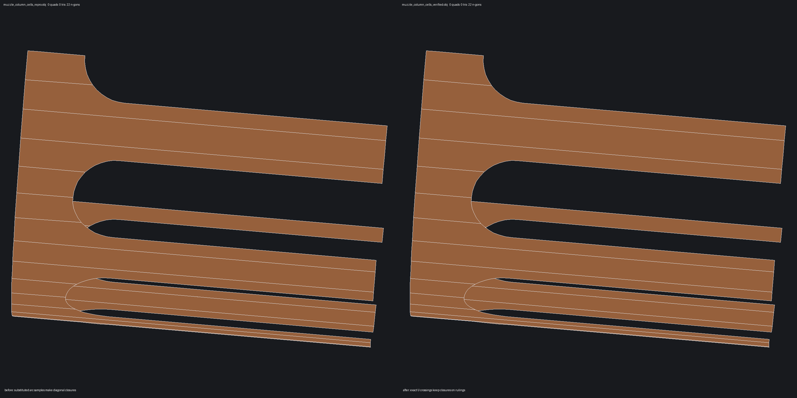
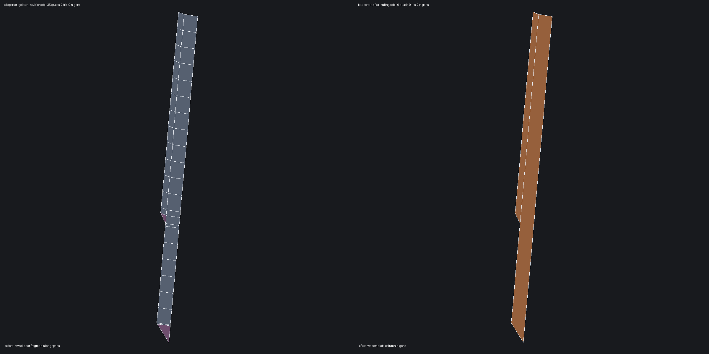

# Column cell builder

Artist model, stated 2026-07-25:

> The cylinder spans go up till they find that arc, then stop at it and it
> becomes the vertex. And the inner boolean shape (half capsule) defines the
> vertex number.

and, on the row-per-arc-sample experiment that preceded this:

> you've made all the ngons straight lines horizontally across the spans.
> I wanted a nice big ngon

## Why the old clipper cannot express it

`meshOrthogonalTrimGrid` decomposes by ROWS: for each row it takes the single
boundary segment crossing the row's midpoint and evaluates it at the row's
floor and ceiling. A cell edge is therefore always a CHORD, so a rounded slot
end came out chamfered and the sliver between chord and arc stayed unfilled.
The only way to make a chord land on the arc is to add a row per arc sample —
and a row is a full ring around the drum, which is the horizontal-line result
the artist rejected.

## What this builds instead

`columnTrimCells()` decomposes by COLUMN:

1. Walk the trim loop and split it at every column-line crossing. A crossing
   within a quarter-pitch of an existing sample is NOT inserted — that sample
   becomes the span's terminus, so no new point is ever created on a shared
   edge and the neighbouring wall's vertex count drives the cut's shape.
2. Each resulting chain lies inside one column strip.
3. On a strip's left and right line the chain ends alternate material
   start/end going up in v, so consecutive pairs are the vertical segments
   that close the cells.
4. Walk chain -> partner -> chain until the cycle closes; that cycle is the
   cell, an n-gon carrying every boundary sample it touches.

## Failure classes and fixes

The first column implementation exposed four independent defects:

1. Crossing snap compared a 2D UV distance with a u-only tolerance. Cylinder u
   is angular while v is linear, so one sample could swallow crossings in
   several strips. Crossing decisions now compare u only.
2. A concave cell's vertex average can lie in the cut. Classification now uses
   an interior ear centroid.
3. A sparse decomposition could omit a boundary chain and still return some
   valid-looking cells. Acceptance is transactional and requires every sampled
   B-rep boundary segment to be present.
4. A chain exactly on an internal column was always assigned to the lower
   strip. The builder now probes the B-rep face on both sides and assigns the
   chain to the material side.

One visual defect remained after all validity metrics passed. A v-dominant
capsule arc was not pinned at its requested U-column crossings. The builder
gave a nearby natural arc sample the logical column index without changing its
actual U coordinate. Adjacent cells therefore shared a diagonal closure rather
than a cylinder ruling. Revolution trim grids now U-pin every trim edge, so the
same exact crossing is sampled by the drum and its neighbour.



## Verified topology

On both target muzzle drum faces:

| Metric | Before complete fix | After |
| --- | ---: | ---: |
| requested spans | 22 | 22 |
| emitted cells | 17 | 22 |
| arc-following n-gons | 17 | 22 |
| diagonal interior closures | 24 / 26 | 0 / 0 |
| unexplained cracks | 2 | 0 |
| non-manifold edges | 4 | 0 |
| winding conflicts | 13 | 0 |
| degenerate polygons | 4 | 0 |

The maintained test also checks all 21 shared cell closures per target face in
3D and rejects any closure that is not parallel to the cylinder axis. This
closes the count-only blind spot that allowed the visible diagonal chord.

The teleporter counterexample exercises sparse internal-column chains. Its two
affected drums move from 35 quads + 2 triangles each to two complete n-gons
each, while the model moves from 24 open mesh edges to watertight output and
keeps its structure-retention baseline.



The pinning and cell changes intentionally move foam and teleporter polygon
arity counts: curved shared edges retain their own samples, and sparse drums
retain long n-gons instead of row fragments. The affected outputs were rendered
and inspected for folds, overlaps, and unintended rings before banking the
counts. Structure debt is unchanged; the corpus invariant gate and strict
release gate pass.

## Scope

The cell builder is gated to `plan.kind == RevolutionGrid` trim grids and falls
back transactionally whenever the decomposition declines. Coons and planar
trim grids retain the established row path.

Reproducer:

```sh
weft extract tests/STEP_Examples/MP9.stp --faces 3432 --rings 1 -o muzzle.step
weft mesh muzzle.step -o muzzle.obj --profile cad --validate --debug
python3 tools/render_obj_wireframe.py muzzle.obj drum.png --faces 21 --azim 95 --elev 8
weft sweep tests/regressions/mp9/muzzle_column_cells.step
```
