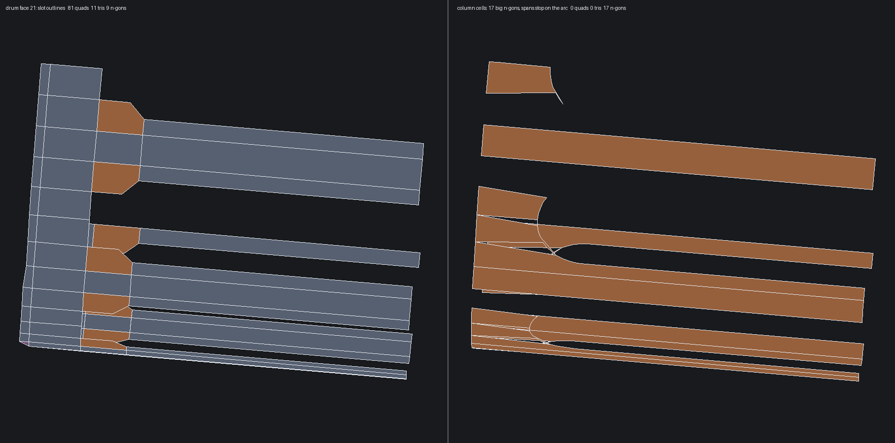

# Column cell builder (IN PROGRESS)

Artist model, stated 2026-07-25:

> The cylinder spans go up till they find that arc, then stop at it and it
> becomes the vertex. And the inner boolean shape (half capsule) defines the
> vertex number.

and, on the row-per-arc-sample experiment that preceded this:

> you've made all the ngons straight lines horizontally across the spans.
> I wanted a nice big ngon

## Why the old clipper cannot express it

`meshOrthogonalTrimGrid` decomposes by ROWS: for each row it takes the single
boundary segment crossing the row's midpoint and evaluates it at the row's
floor and ceiling. A cell edge is therefore always a CHORD, so a rounded slot
end came out chamfered and the sliver between chord and arc stayed unfilled.
The only way to make a chord land on the arc is to add a row per arc sample —
and a row is a full ring around the drum, which is the horizontal-line result
the artist rejected.

## What this builds instead

`columnTrimCells()` decomposes by COLUMN:

1. Walk the trim loop and split it at every column-line crossing. A crossing
   within a quarter-pitch of an existing sample is NOT inserted — that sample
   becomes the span's terminus, so no new point is ever created on a shared
   edge and the neighbouring wall's vertex count drives the cut's shape.
2. Each resulting chain lies inside one column strip.
3. On a strip's left and right line the chain ends alternate material
   start/end going up in v, so consecutive pairs are the vertical segments
   that close the cells.
4. Walk chain -> partner -> chain until the cycle closes; that cycle is the
   cell, an n-gon carrying every boundary sample it touches.

## Current state (muzzle extract, pins + column cells)

| | row clipper | column cells |
| --- | --- | --- |
| drum cells | 101 | 17 big n-gons |
| end wall arc verts shared with drum | 3 | 12 |
| unexplained cracks | 0 | 2 |
| winding | consistent | 13 conflicting pairs |



The shape is right — big n-gons that follow the arc, spans terminating on the
wall's own vertices — and it is close, but not correct yet.

## Known defects, in the order to fix them

1. **Chains still span several strips.** 22 spans produce only 17 cells, and
   the render shows cells crossing each other. Splitting the loop at column
   crossings should confine every chain to one strip, so a crossing is being
   skipped. The quarter-pitch snap window is the first suspect (it may be
   swallowing legitimate crossings); the second is `lineAt()` marking interior
   nodes as on-line too generously.
2. **Orientation.** 13 winding conflicts: cells are wound from the UV signed
   area against `faceReversed`, which is right per cell but evidently not
   consistent with the neighbours here.
3. **Coverage.** 2 unexplained cracks, and one wall shares 5 arc vertices
   where its twin shares 12 — so some region is still not being emitted.

A units bug was already found and fixed here: the crossing-snap compared a UV
distance against a u tolerance, and on a cylinder u is radians while v is
millimetres, so crossings far along a span read as coincident with the sample.

## Scope

Gated to `plan.kind == RevolutionGrid` trim grids and falls back to the row
clipper whenever the decomposition declines, so nothing else can regress while
this is in progress.

Reproducer, about one second:

```sh
weft extract tests/STEP_Examples/MP9.stp --faces 3432 --rings 1 -o muzzle.step
weft mesh muzzle.step -o muzzle.obj --profile cad --validate --debug
python3 tools/render_obj_wireframe.py muzzle.obj drum.png --faces 21 --azim 95 --elev 8
```
