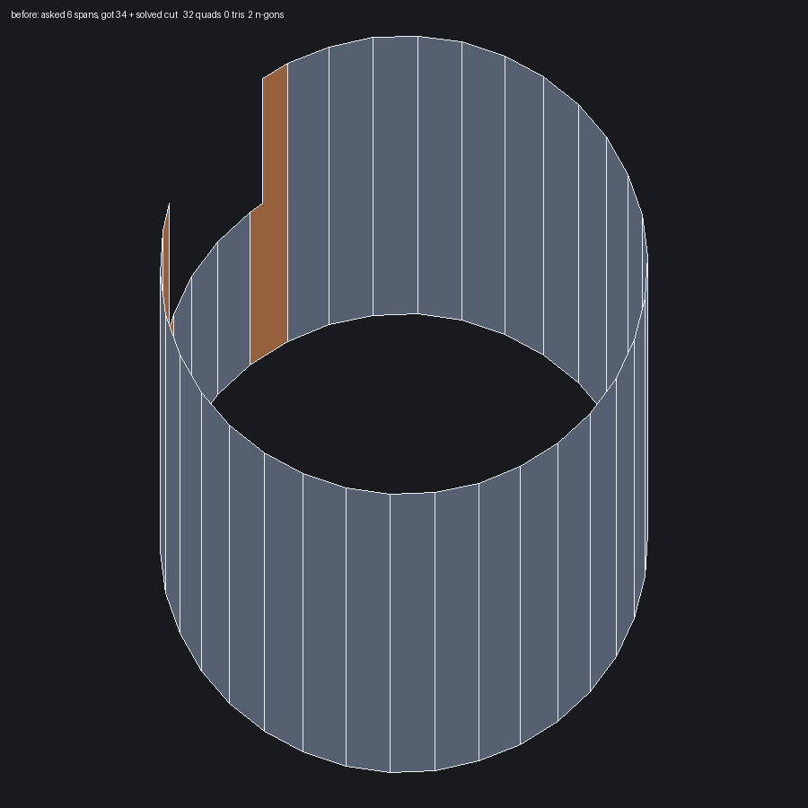
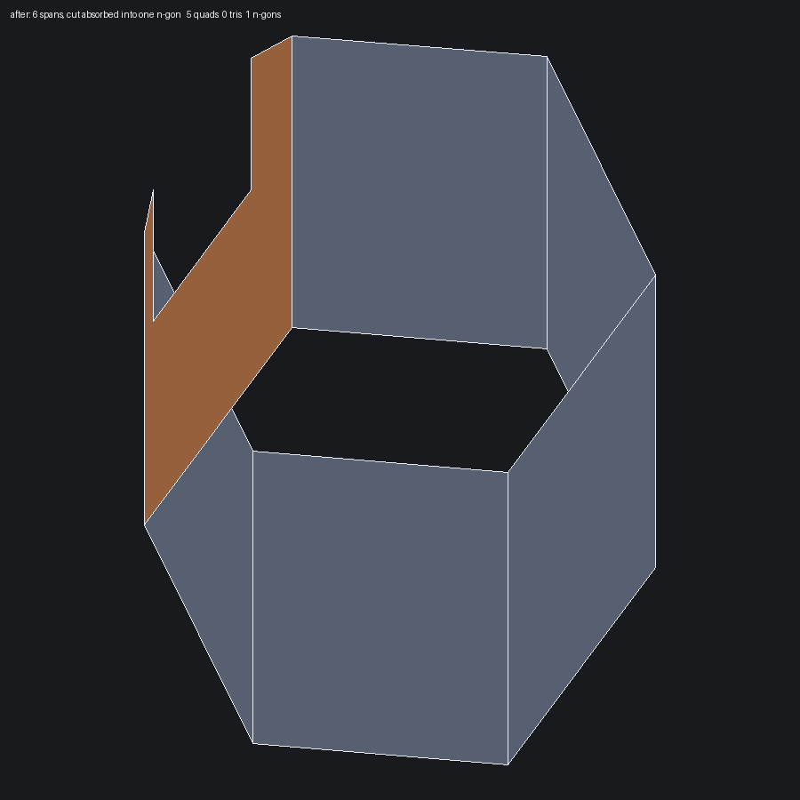

# Cut cylinders keep their spans (2026-07-25)

Artist instruction:

> Long spans should maintain the full cylinder length, and not be broken up.
> Basically the cylinder should just be normal with no solutions for
> triangulation or booleans, and simply allow an ngon to sit where cuts into
> the cylinder exist. So if a cylinder with a notch for example exists, if I
> set it to 6 spans the cylinder retains exactly 6 spans and the cutout
> doesn't solve, it just allows ngons.

## What went wrong

Two independent failures stacked on the same request.

1. The typed count was discarded. A radial-only LOWER soft-proposed instead of
   pinning, so a neighbour's curvature count outvoted it: asking a notched
   drum for 6 spans produced 34 (`[rim not free]`).
2. The cut had to be "solved". `meshRevolutionRimNotch`'s clean-cut path lays a
   uniform column lattice and boolean-cuts the notch out of it, which is right
   — but only when the notch corners land on column azimuths. At 6 spans they
   fall mid-cell, it bailed, and the strip path answered with a feature row, a
   transition strip and wall ladders. Further down the fallback chain the whole
   model triangulated (`--radial 6` gave 660 triangles).

Separately, the flaregun open band promoted each notch lip onto every column,
which turned a local lip into a full-band ring that cut every long span in two
— the same defect from the other direction.

## Change

Sector absorption, in `meshRevolutionRimNotch`, after the clean cut is tried:

- A column exists wherever the base arc already carries a sample at that
  azimuth (the pins put them there).
- Between two consecutive such columns the region is closed by the TRUE
  outline, so a plain sector is a quad and the notch sector is a single n-gon
  following wall, floor and wall.
- Only existing border samples are used, so the contract with the rim and
  notch faces is untouched and the result stays watertight.

Alignment is irrelevant: the notch never has to fit the lattice. The clean-cut
path is kept ahead of it because it yields all-quads when the corners do line
up, and the strip path is now only reachable when neither applies.

In `meshRevolutionOpenBand`, a notch lip goes back to the notch's own bounding
columns instead of every column, so it can never become a ring.

## Result on the `notched` fixture

| spans requested | spans built | wall polygons | triangles |
| --- | --- | --- | --- |
| 6 | 6 | 5 quads + 1 n-gon | 0 |
| 8 | 8 | 6 quads + 2 n-gons | 0 |
| 12 | 12 | 10 quads + 2 n-gons | 0 |

Before, the same request produced 34 spans and a boolean-solved notch:

| before | after |
| --- | --- |
|  |  |

## Corpus effect

- flaregun: triangles 1048 → 417, face 43 back on `RevolutionGrid` (it had
  fallen to a 323-triangle contract floor once the lip became a ring)
- teleporter: failed-floor 14 → 10 (cad), 18 → 17 (default); structured up
- hole-plate rows (`plate_holes`, `ellipse_plate`, `slitdrill`, `demo`,
  `torture`, `iso14649-demo`) drop quads because this branch also carries the
  no-collar hole-plate default from the artist-density work
- structure ratchet reports only BETTER; no case regressed

Regression: `testNotchedCylinderKeepsRequestedSpans` discovers the notched
full-period wall, asks for 6 / 8 / 12 spans and asserts the built count equals
the request, the face keeps its planned mesher, the cut lands in an n-gon, and
no triangles appear. `testFlaregunOpenBandNotchLipsFullSpan` now asserts the
inverse of what it did before: mid-span full-band rings may not exceed the
band's own solved axial count, so a cut can never add one.
