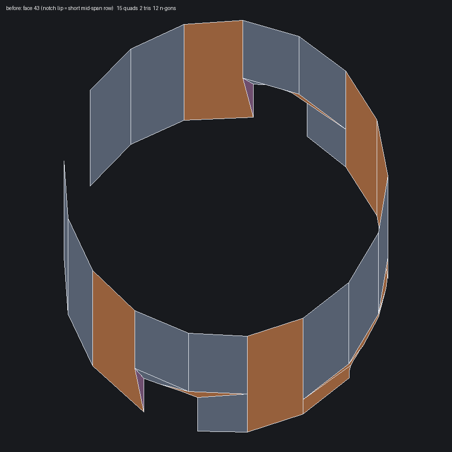
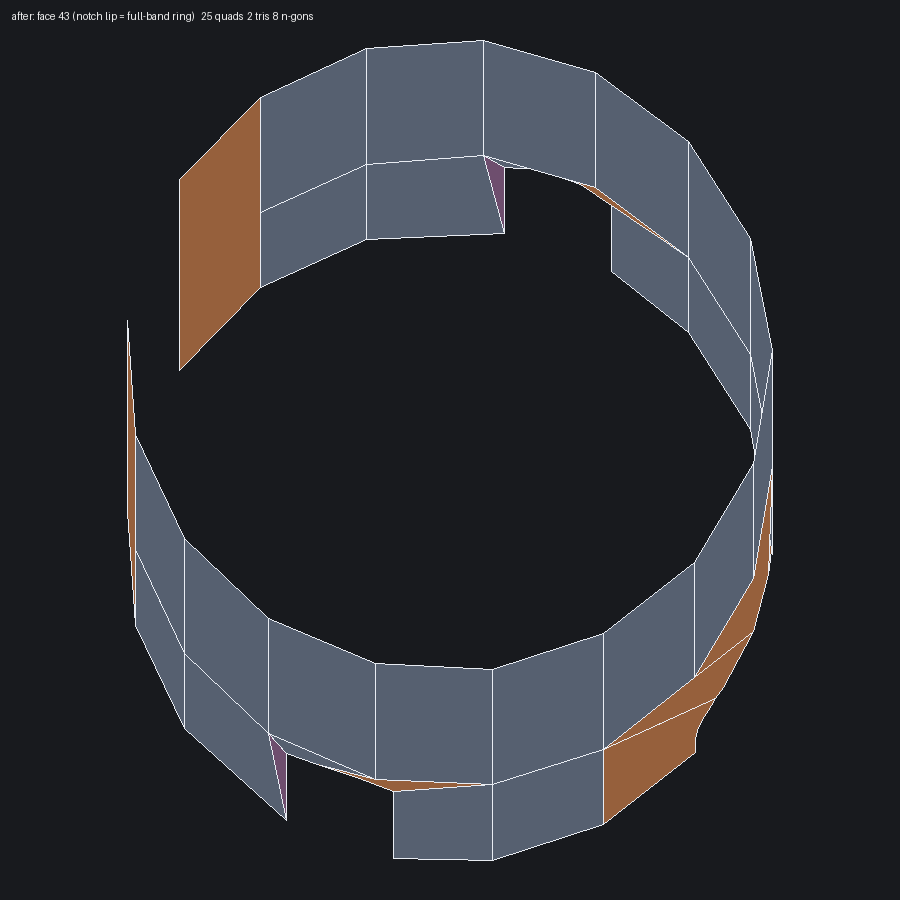
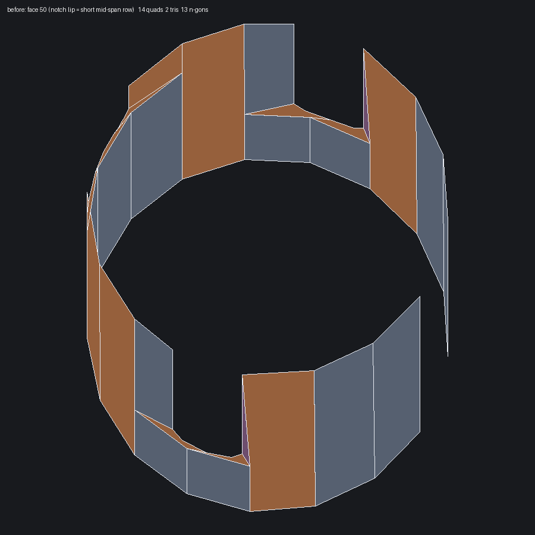
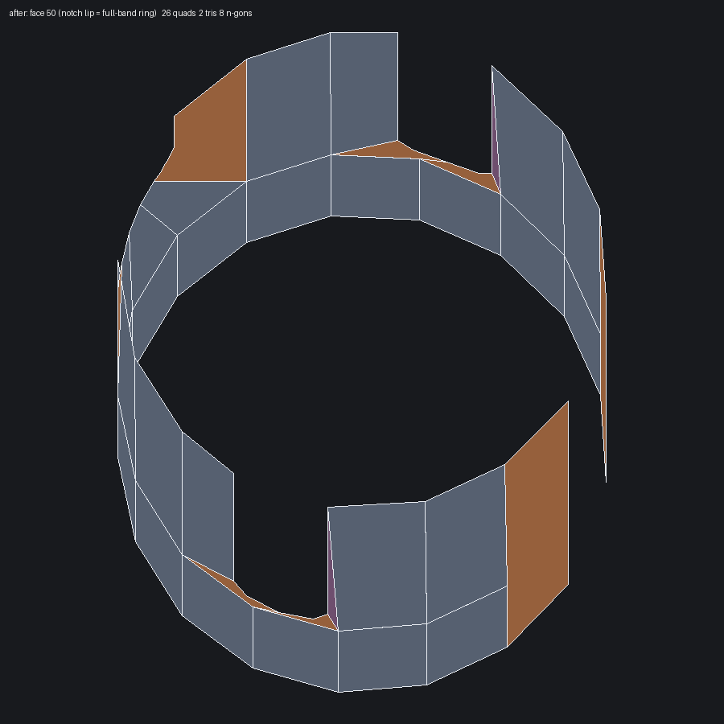

# flaregun open-band notch lip → full-band ring (2026-07-24)

Artist report: "On flaregun, the cylinder has the edge again that isn't fully
contained along the cylinder."

## Root cause

`meshRevolutionOpenBand` gave each castellated notch a private feature row
(`Region::rowfW`) and attached it only to that notch's bounding and interior
columns. Away from the notch no column carried the station, so the lip was a
short horizontal edge that started and stopped mid-band — an edge that does
not run with the cylinder. Rim-grounding (WP3) had already removed the
full-width bottom transition strip, which left this lip as the only remaining
partial ring, so it became the visible artifact.

## Change

Two steps, both in `meshRevolutionOpenBand`:

1. Snap a lip onto an existing full-band axial station when one sits within
   half an axial pitch above it.
2. Promote every surviving lip key onto every column, so the lip is a complete
   ring even when the band solves to a single axial step (`nv == 1`), which is
   the default CAD case on both barrel halves.

## Count delta (intentional)

| case | quads | tris | n-gons |
| --- | --- | --- | --- |
| flaregun cad before | 3873 | 421 | 138 |
| flaregun cad after | 3895 | 421 | 129 |
| flaregun default before | 4383 | 1285 | 151 |
| flaregun default after | 4402 | 1285 | 141 |

The signature matches the intent: triangles are unchanged, n-gons fall, quads
rise. Lip spans that were previously absorbed into tall full-height n-gons are
now ordinary quad rows split by the new ring.

Per-face totals for the two barrel halves:

| face | before | after |
| --- | --- | --- |
| 43 | 15 quads, 2 tris, 12 n-gons | 25 quads, 2 tris, 8 n-gons |
| 50 | 14 quads, 2 tris, 13 n-gons | 26 quads, 2 tris, 8 n-gons |

## Visual inspection

Orange is an n-gon, blue-grey a quad, purple a triangle. Before, tall orange
n-gons span the full band height and no station runs around it. After, a
continuous circumferential ring splits the band into quad rows and the
remaining n-gons are local to the notch mouths.

| before | after |
| --- | --- |
|  |  |
|  |  |

Rendered with `tools/render_obj_wireframe.py` (dependency-light companion to
the Blender renderer):

```sh
build/cli/weft mesh tests/STEP_Examples/flaregun.stp -o fg.obj --profile cad
python3 tools/render_obj_wireframe.py fg.obj face43.png --faces 43 \
    --azim -70 --elev 12
```

## Regression

`testFlaregunOpenBandNotchLipsFullSpan` discovers multi-edge IsoBand drums on
`flaregun.stp` and asserts no mid-span parameter-v station carries far fewer
vertices than the band's full column count. flaregun stays watertight
(0 open, 0 non-manifold) in both profiles.
